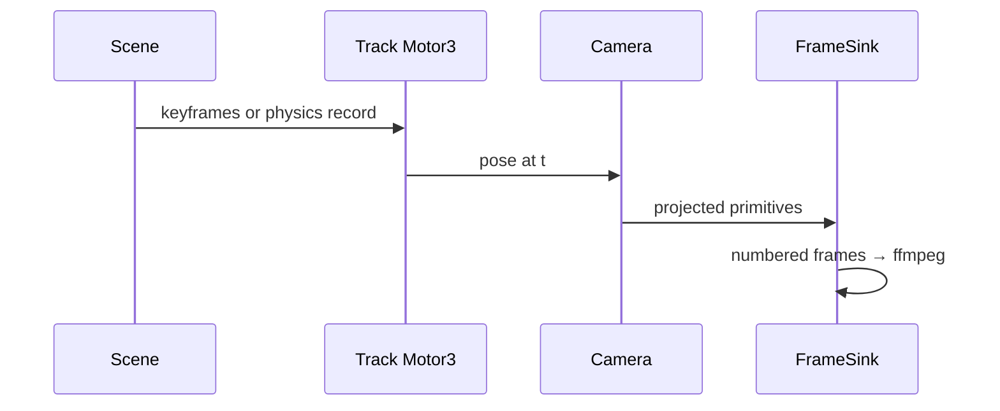

# Arquitectura — motoreel

## Propósito

Offline deterministic animation engine: keyframed or physics-recorded motor tracks → numbered frames → video.

## Mapa de módulos

```
motoreel/crates/motoreel/src/
├── track.rs, ease.rs   # Motor slerp + easing (time remap only)
├── scene.rs, object.rs # Scene graph
├── camera.rs           # Projection (matrices allowed here)
├── record.rs           # Physics rollout → tracks
├── prim.rs, label.rs   # 2D primitives + anchored labels
└── sink.rs, svg.rs, ppm.rs
```

## Diagrama de componentes



## Capas y responsabilidades

Ver [code-walkthrough.md](./code-walkthrough.md) para el recorrido módulo a módulo.

## Documentación adicional

- `docs/RFC-012-garust-anim.md`
- `requirements/`
- `specs/`
- `ROADMAP.md`
