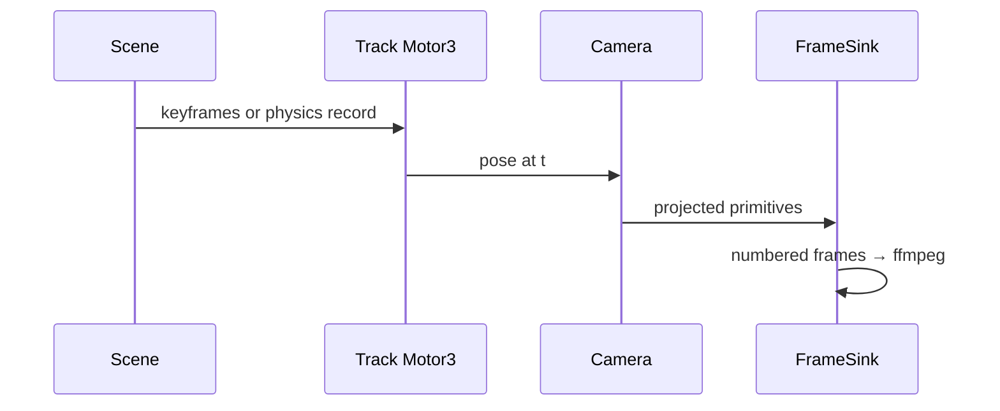
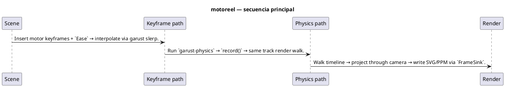

# Flujos — motoreel

## Flujo principal (Mermaid)



## Descripción paso a paso

1. **Scene** — Build `Scene` with objects and camera; motion lives in `Track<Motor3>`.
2. **Keyframe path** — Insert motor keyframes + `Ease` → interpolate via garust slerp.
3. **Physics path** — Run `garust-physics` → `record()` → same track render walk.
4. **Render** — Walk timeline → project through camera → write SVG/PPM via `FrameSink`.

## Secuencia (PlantUML)

Fuente: [`diagrams/flow-sequence.puml`](./diagrams/flow-sequence.puml)



## Componentes / estados (PlantUML)

Fuente: [`diagrams/flow-architecture.puml`](./diagrams/flow-architecture.puml)

```plantuml
@startuml
title motoreel — secuencia

participant "S" as Scene
participant "T" as Track Motor3
participant "C" as Camera
participant "F" as FrameSink
S -> T: keyframes or physics record
T -> C: pose at t
C -> F: projected primitives
F -> F: numbered frames → ffmpeg

@enduml
```

## Estados y casos borde

Consulta los tests de integración y los RFC/requirements del proyecto para flujos de error y recuperación.
